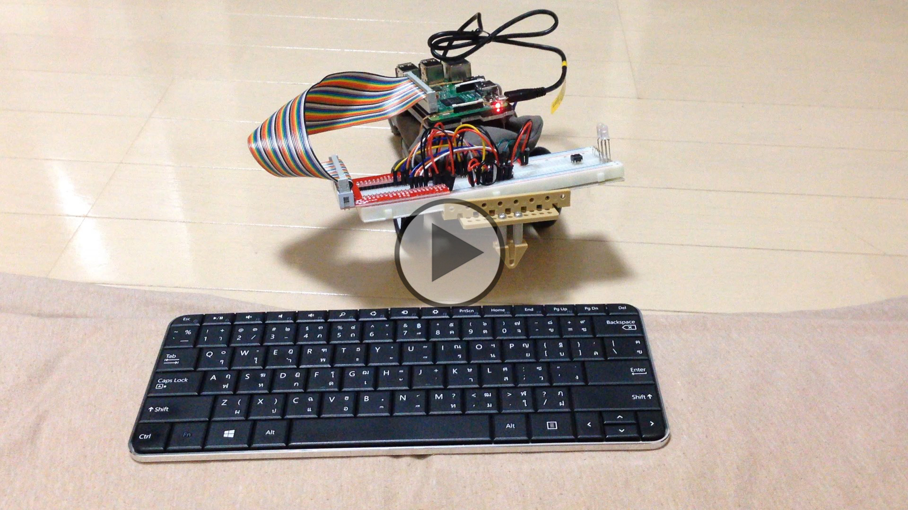

# lr_motor
Left-right motor control with Node.js on a GPIO of the Raspberry Pi.

This project is to learn how to control dual-motor (left-right) by using Raspberry Pi.
THe code provided here is written in Node.js, which require a package of
- 'pigpio' is to access GPIO port on the Raspberry Pi.
- 'keypress' is to listen to the keyboard input of the Arrow-key (up-down-left-right).

Requirement
- Raspberry Pi
- Motor driver IC
- Installing pigpio Ref: https://www.npmjs.com/package/pigpio

This experiment support two different motor drivers.
- Toshiba - TB6612FNG
- Texus Instrument - L293D

Node:
- TB6612FNG is more efficient, but more expansive (10$), and you will need a solder.
- L293D is much cheaper ($0.6) and easier to be used with a breadboard.

# Running with TB6612FNG
Wiring diagram for TB6612FNG
[]

## How to run
`$ sudo node app_t.js`

# Running with L293D

Wiring diagram for L293D
[]

## How to run
`$ sudo node app_l.js`

Node: 'sudo' is needed if you are running as a different user, not root.